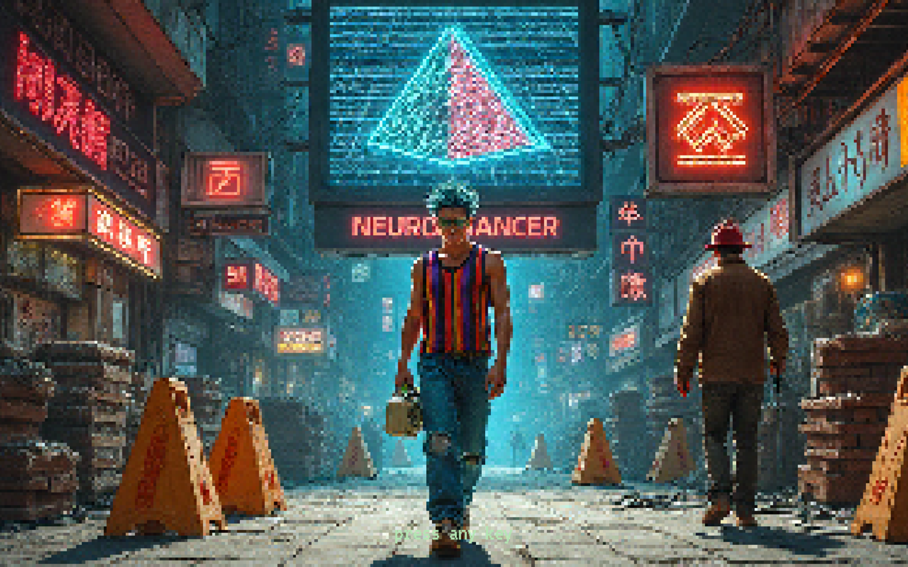
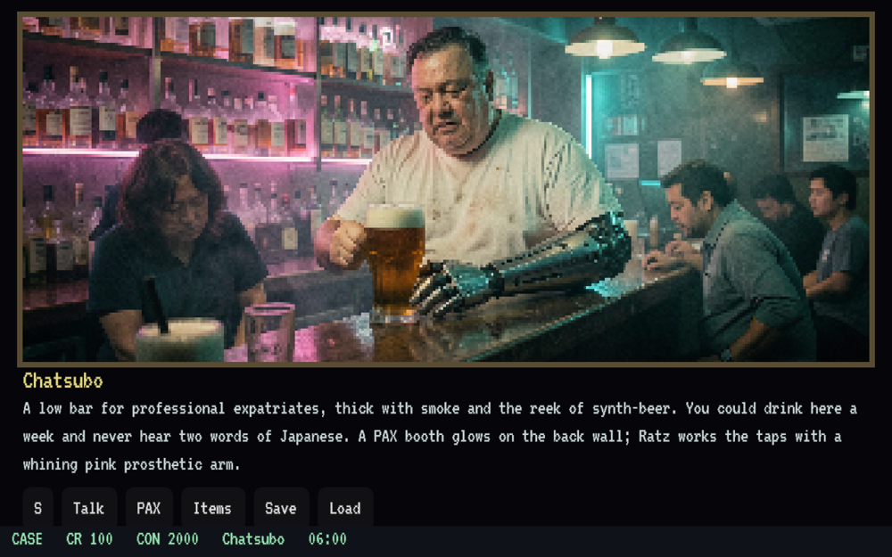
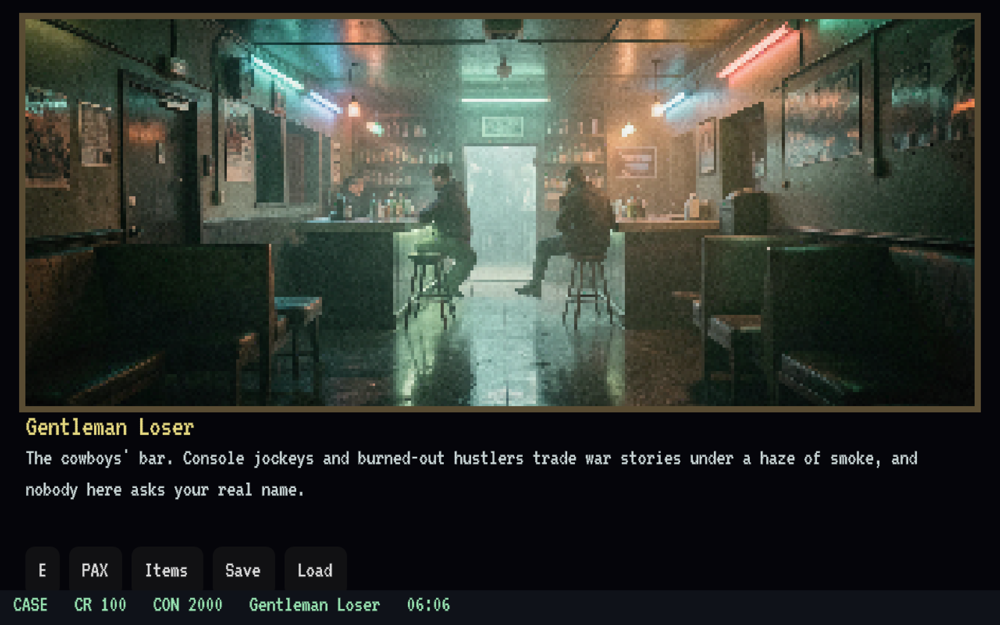
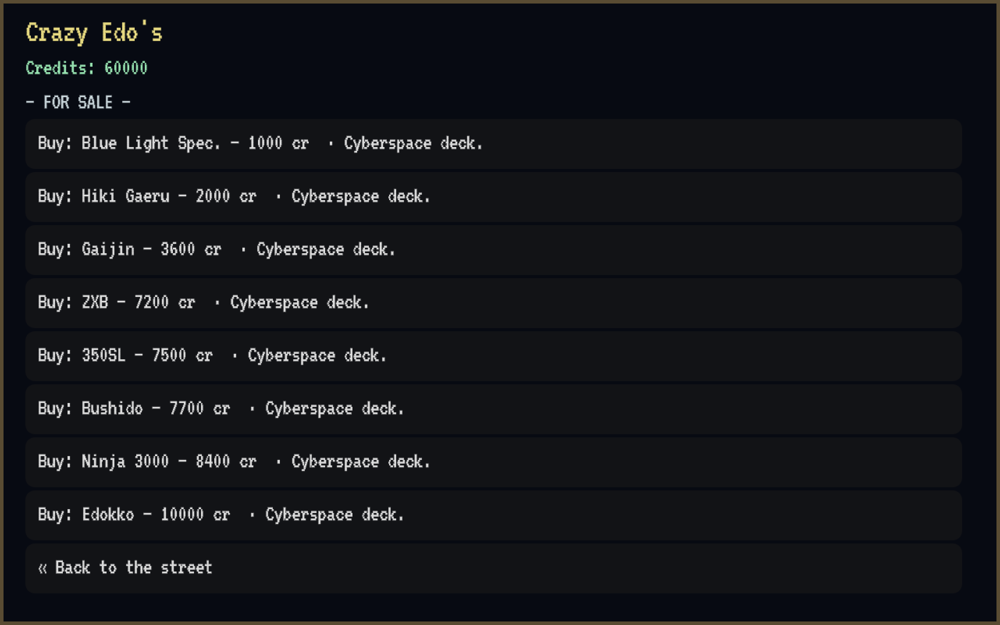
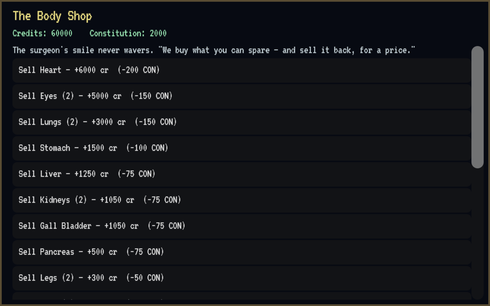
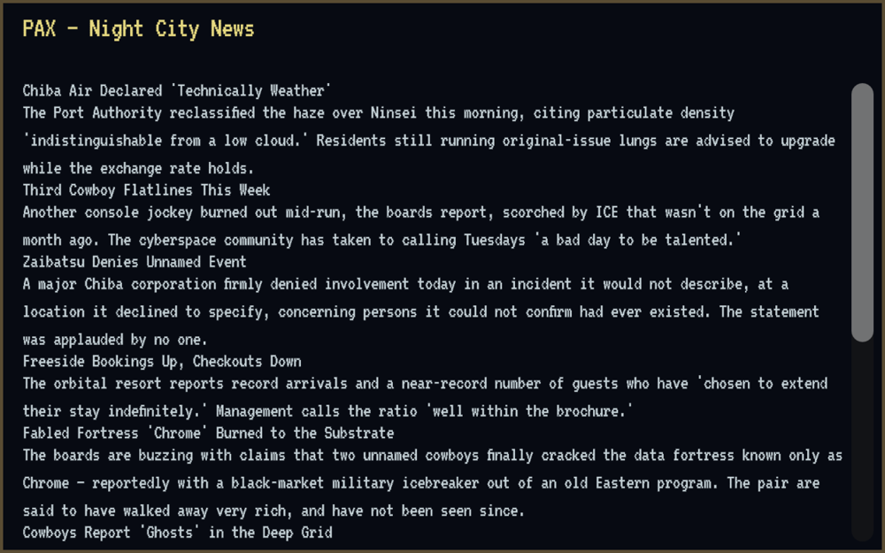
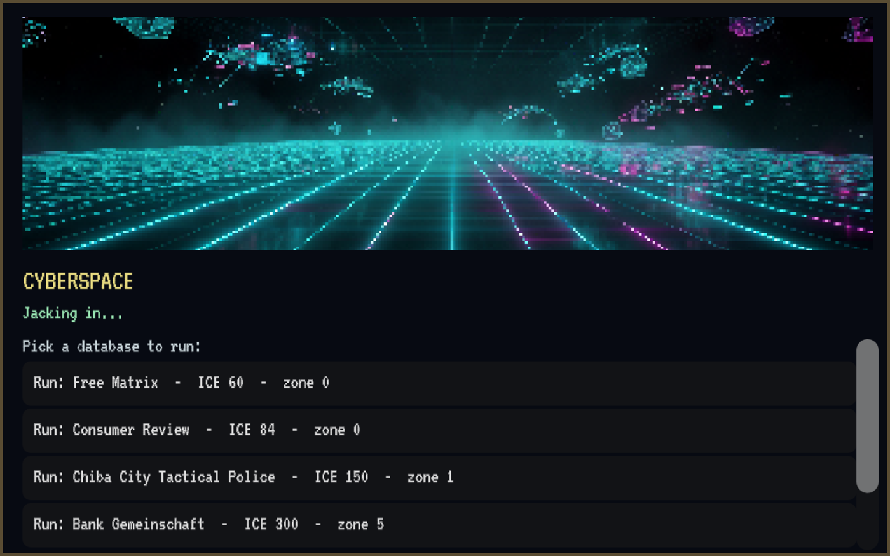

<p align="center"></p>

<p align="center"><strong>A 2026 fan remake.</strong></p>

# Neuromancer (Godot 4 Remaster)

A faithful, standalone **remaster** of **Neuromancer** — the 1988 Interplay cyberpunk
adventure based on William Gibson's novel — rebuilt in **Godot 4** with modern,
freely-licensed art and freshly-written prose. Exports to web, desktop, and mobile.

> **Status:** 🟢 Playable. All of Chiba City + Freeside is explorable (56 rooms), with
> working shops, the economy, the Body Shop organ bank, the PAX terminal, and NPC
> conversations. Cyberspace & ICE combat (M3) are in progress.

## A remaster, not a reimagining

The **game** is reproduced faithfully from the 1988 original — the map, rooms, exits,
quests, mechanics, shop stock, prices, and the win path are the real thing
(cross-referenced against [Javamancer](https://github.com/maehem/javamancer)). But every
**displayed asset is our own**:

- **Art** — AI-generated cyberpunk plates, deliberately **pixelated in-engine** for a
  retro-blocky feel, with crisp text on top.
- **Prose** — freshly authored room descriptions, NPC dialogue, and the PAX news & BBS,
  written in the original's tone (with a few Sprawl-trilogy Easter eggs hidden in the feed).

The result plays like the classic but **ships standalone — no original game files required.**

## Screenshots

📖 Browse every plate in **[The Art of a Neuromancer Fan Remake](docs/The-Art-of-a-Neuromancer-Fan-Remake.pdf)** — a PDF gallery of all 56 room plates and the full cyberspace set.

|  |  |
|:---:|:---:|
| **The Chatsubo** — Ratz works the bar | **The Gentleman Loser** — the cowboys' bar |
|  |  |
| **Crazy Edo's** — real cyberdecks, real prices | **The Body Shop** — sell your organs for credits |
|  |  |
| **The PAX terminal** — our own Chiba City news & BBS | **Cyberspace** — the matrix *(in progress)* |
|  |  |

## Run it

```sh
git clone https://github.com/CryptoJones/neuromancer-godot.git
cd neuromancer-godot
./run.sh
```

Requires **Godot 4.6**. `run.sh` clears the import cache, defaults to software rendering
on Linux (smooth on low-end boxes and Chromebooks), and launches. No `.DAT` files needed.

## What's playable

- All **56 rooms** of Chiba City + Freeside, with the real map & exits
- **Shops & economy** — Crazy Edo's and Asano's (the authentic cyberdecks + prices),
  inventory, half-price resale
- **The Body Shop organ bank** — sell organs for credits at a constitution cost (and buy
  them back later), on the real 0–2000 scale
- **The PAX terminal** — owned news & message base, in booths around the city
- **NPCs** — Ratz, Shin (who hands back your impounded deck), and Julius Deane
- **An original score** — area-reactive cyberpunk music that crossfades as you move
  between the streets, the shops, the Body Shop, and cyberspace. Browse the album in
  [`soundtrack/`](soundtrack/)

## Standing on the shoulders of 🙏

This remaster would not be possible without the reverse-engineering and porting work of:

- **[Henadzi Matuts](https://github.com/HenadziMatuts)** — author of
  **[Reuromancer](https://github.com/HenadziMatuts/Reuromancer)** (MIT) and the
  ["Reversing the Neuromancer"](https://henadzimatuts.github.io/2018/03/30/reversing-the-neuromancer-part-1.html)
  blog series, which document the `.DAT` archive format, the two-stage image
  decompression, and the VGA sprite/palette encoding.
- **[maehem](https://github.com/maehem)** — author of
  **[Javamancer](https://github.com/maehem/javamancer)** (MIT), a near-complete and
  *winnable* Java port that is our reference for the map, dialog flow, shop tables,
  cyberspace navigation, and turn-based ICE combat.
- **Interplay Productions** and the original 1988 team — Bruce Balfour, Brian Fargo,
  Troy A. Miles, and Michael A. Stackpole — and **William Gibson**, whose novel started
  it all.

Full attribution in [CREDITS.md](CREDITS.md). Both upstream projects are MIT-licensed;
where we adapt their code we preserve their notices.

## Optional: purist "original assets" mode

The shipped game uses our own art and prose, so it needs nothing else to play. If you own
the original and want the *authentic* 1988 text/art, `tools/extract_dat` can pull them
from your own `NEURO1/2.DAT` (ScummVM-style, bring-your-own-files) — but it is **not
required**.

## Roadmap

See [BACKLOG.md](BACKLOG.md): **M0** asset pipeline ✅ → **M1** Chiba City ✅ → **M2**
economy & shops ✅ → **M3** cyberspace & ICE combat (in progress) → **M4** endgame & full
owned-asset build → **M5** polish & multi-platform release.

## License

[MIT](LICENSE) for our code. The original game and its content are **not** covered — see
CREDITS.md and the note in the license.

---

*Proudly Made in Nebraska. Go Big Red! 🌽 <https://xkcd.com/2347/>*
